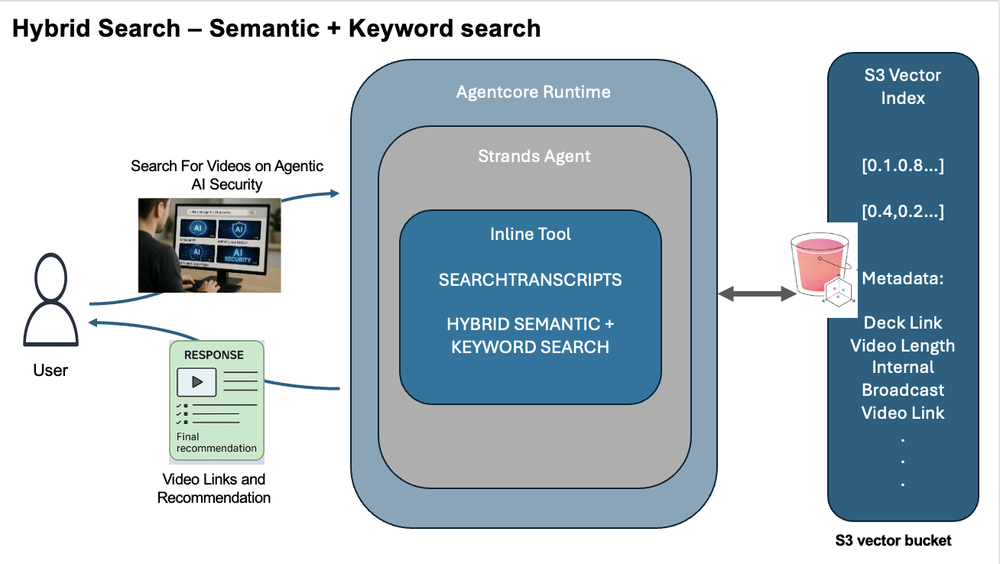

# Search Excel Tool with Strands Agent

This guide provides clear, step-by-step instructions for deploying AWS infrastructure and a conversational agent that indexes an Excel content catalog and retrieves video content based on user prompts. It is tested on macOS but can be adapted for Linux.

If you're on Windows, you should be able to use WSL2 or another method to run shell scripts.

## Table of Contents

- [Prerequisites](#prerequisites)
- [Architecture Overview](#architecture-overview)
- [Part 1: Initial Configuration](#part-1-initial-configuration)
  - [Configure Your Environment](#configure-your-environment)
  - [Generate AWS Permissions Policy (Optional)](#generate-aws-permissions-policy-optional)
- [Part 2: Deploy Infrastructure and Index Data](#part-2-deploy-infrastructure-and-index-data)
  - [Deploy the Infrastructure](#deploy-the-infrastructure)
  - [Upload and Index the Content Catalog](#upload-and-index-the-content-catalog)
  - [Verify Index Creation](#verify-index-creation)
- [Part 3: Deploy and Test the Agent](#part-3-deploy-and-test-the-agent)
  - [Deploy the Agent Application](#deploy-the-agent-application)
  - [Set Up Python Environment and Test](#set-up-python-environment-and-test)
- [Cleanup](#cleanup)
- [Take the Security Quiz](#take-the-security-quiz)

## Prerequisites

Set up the following tools and configurations before starting. Commands are provided for macOS, Linux (Ubuntu/Debian, CentOS/RHEL),.

- **AWS Permissions**: Ensure your AWS user or role has permissions defined in `output-sso-policy.json`. A script is provided to generate this policy if needed.
- **Bash Shell**: Required for running deployment scripts. Available by default on macOS and Linux.
- **Python 3.12+**: Install Python 3.12 or higher and use a virtual environment (`venv`). Verify with:
  ```bash
  python3 --version
  ```
  - **macOS**: `brew install python@3.12`
  - **Ubuntu/Debian**: `sudo apt-get update && sudo apt-get install python3.12 python3.12-venv python3.12-dev`
  - **CentOS/RHEL**: `sudo yum install python3.12`
 Install WSL2 with `wsl --install`, then use Ubuntu instructions.
- **AWS CLI**: Install the latest version of the [AWS CLI](https://aws.amazon.com/cli/). Verify with:
  ```bash
  aws --version
  ```
  - **macOS**: `brew install awscli`
  - **Ubuntu/Debian**: `sudo apt-get install awscli` or `curl "https://awscli.amazonaws.com/awscli-exe-linux-x86_64.zip" -o "awscliv2.zip" && unzip awscliv2.zip && sudo ./aws/install`
  - **CentOS/RHEL**: `sudo yum install awscli`
 Use Ubuntu instructions after installing WSL2.
- **Docker**: Install [Docker Desktop](https://docs.docker.com/desktop/setup/install/mac-install/) (macOS) or Docker for Linux. Ensure the `buildx` plugin is included. Verify with:
  ```bash
  docker --version
  ```
  Example output: `Docker version 28.3.2, build 578ccf6` (newer versions are fine).
  ```bash
  docker buildx version
  ```
  Example output: `github.com/docker/buildx v0.25.0-desktop.1 2cf9a0c...` (newer versions are fine).
  - **macOS**: Install via Docker Desktop link.
  - **Ubuntu/Debian**: `sudo apt-get update && sudo apt-get install docker.io docker-buildx-plugin`
  - **CentOS/RHEL**: `sudo yum install docker`
 Install Docker Desktop, enable WSL2 integration, then run `sudo apt-get install docker.io docker-buildx-plugin` in WSL2.
- **jq**: Install `jq` for JSON parsing in cleanup scripts. Verify with:
  ```bash
  jq --version
  ```
  Example output: `jq-1.6` (newer versions are fine).
  - **macOS**: `brew install jq`
  - **Ubuntu/Debian**: `sudo apt-get install jq`
  - **CentOS/RHEL**: `sudo yum install jq`
 Use Ubuntu instructions after installing WSL2.
- **Core Utilities**: Ensure standard Unix tools (`bash`, `sed`, `awk`, `grep`, `mktemp`, `rm`, `cat`, `sleep`) are available. These are included by default on macOS and Linux.
- **Repository Structure**: Run all commands from the repository's root directory unless specified otherwise.

## Architecture Overview

Understand how the components interact to index and retrieve content with this architecture diagram:



## Part 1: Initial Configuration

Configure your environment and AWS permissions to prepare for deployment.

### Configure Your Environment

1. Open `env.sh` in the repository's root directory.
2. Set the following variables with your values:
   ```bash
   # Unique version tag for AWS resource naming (e.g., v43, test1)
   export VERSION="your-version"

   # AWS Region, Profile Name, and Account ID
   export REGION="your-region"
   export PROFILE="your-profile"
   export ACCOUNT_ID="your-account-id"
   ```
   > **Note**: Save `env.sh` to persist these values.

### Generate AWS Permissions Policy (Optional)

If your AWS user or role lacks required permissions, generate a policy:

1. Make the `render-sso-policy.sh` script executable:
   ```bash
   chmod +x render-sso-policy.sh
   ```
2. Generate `output-sso-policy.json`:
   ```bash
   ./render-sso-policy.sh env.sh sso-profile-policy.json output-sso-policy.json
   ```
3. Apply the policy using the [AWS Management Console](https://aws.amazon.com/console/) or AWS CLI.

## Part 2: Deploy Infrastructure and Index Data

Deploy AWS resources and index the Excel content catalog.

### Deploy the Infrastructure

1. Make the `deploy.sh` script executable:
   ```bash
   chmod +x deploy.sh
   ```
2. Deploy resources (takes ~5 minutes):
   ```bash
   ./deploy.sh
   ```
   - Look for `✅ Deployment complete` to confirm success.

### Upload and Index the Content Catalog

1. Load environment variables:
   ```bash
   source ./env.sh
   ```
2. Upload `content_catalog.xlsx` to the source S3 bucket:
   ```bash
   aws s3 cp content_catalog.xlsx s3://$SOURCE_BUCKET_NAME/ \
     --region "${REGION}" \
     --profile "${PROFILE}"
   ```

### Verify Index Creation

1. Wait ~2 minutes for indexing to complete.
2. Verify the index:
   ```bash
   aws s3vectors list-indexes \
     --vector-bucket-name agentcore-vector-bucket-${ACCOUNT_ID}-${VERSION} \
     --region "${REGION}" \
     --profile "${PROFILE}"
   ```
   - Success shows an `"indexes"` array with your index details.

## Part 3: Deploy and Test the Agent

Deploy and test the conversational agent.

### Deploy the Agent Application

1. Navigate to the agent deployment directory:
   ```bash
   cd backend-app-agentcore-runtime-deployment
   ```
2. Make the deployment script executable and run it (takes ~5-6 minutes):
   ```bash
   chmod +x deploy-app-to-agentcore-runtime.sh
   ./deploy-app-to-agentcore-runtime.sh
   ```

### Set Up Python Environment and Test

1. Create and activate a Python virtual environment:
   ```bash
   python3 -m venv virtual-environment
   source virtual-environment/bin/activate
   ```
2. Install required packages:
   ```bash
   pip install -r requirements.txt
   ```
3. Set the AWS profile:
   ```bash
   export AWS_PROFILE=${PROFILE}
   ```
4. Test the agent:
   ```bash
   agentcore invoke '{"prompt":"I want to present to a CISO on agentic AI security"}'
   ```
   - Expect a JSON response with video recommendations.

## Cleanup

Remove deployed resources to avoid AWS charges.

1. **Clean Up the Agent Runtime**:
   - From the `backend-app-agentcore-runtime-deployment` directory:
     ```bash
     chmod +x cleanup_agentcore_runtime.sh
     ./cleanup_agentcore_runtime.sh
     ```
2. **Delete AWS Infrastructure**:
   - Return to the repository root:
     ```bash
     cd ..
     ```
   - Run the cleanup script:
     ```bash
     chmod +x delete.sh
     ./delete.sh
     ```

## Take the Security Quiz

After completing the deployment and testing, you can take the security quiz to assess your understanding of the agentic AI security concepts covered.

1. Locate the `Security-Quiz.html` file in the repository's root directory.
2. Open the file in a web browser:
   - **macOS/Linux**: Run the following command from the repository root:
     ```bash
     open Security-Quiz.html
     ```
   - **Windows (WSL2)**: Use the following command to open the file in your default Windows browser:
     ```bash
     wslview Security-Quiz.html
     ```
   - Alternatively, navigate to the file in your file explorer and double-click to open it in your default web browser.
3. Follow the instructions in the quiz to complete it and review your results.